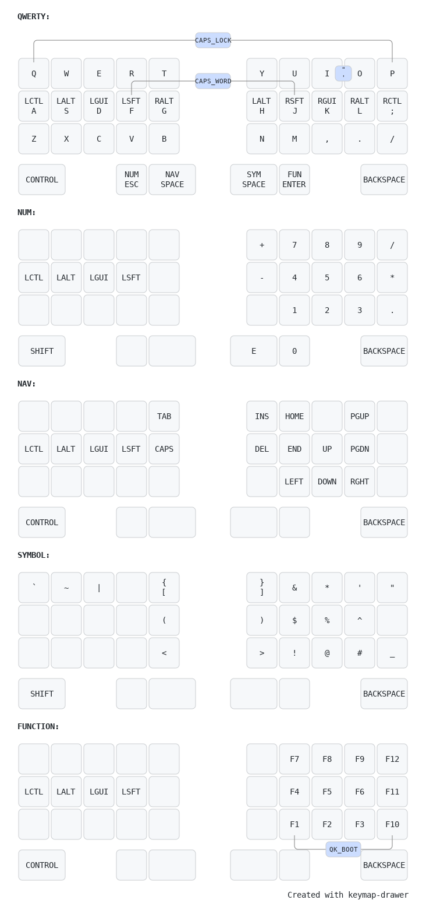

# Keymap

> **Note:** LGUI/LALT and RALT/RGUI are automatically switched when connected to a Mac.

## How to generate

Generated with [keymap drawer](https://keymap-drawer.streamlit.app/).

To update, use the `keymap.yaml` file in keymap drawer editor and override the layout with the `keyboard.json`.

### How to create the initial keymap.yaml

First a `keymap.json` was generated from the QMK `keymap.c` file using the following command:

    qmk c2json --no-cpp -kb endgame -km default -o keymap.json

This was then loaded as a 'QMK keymap' in [keymap drawer](https://keymap-drawer.streamlit.app/) to parse an initial `keymap.yaml` file from.

## How to create initial layout for the keyboard.json

Initial layout can be created in the [keyboard layout editor](https://www.keyboard-layout-editor.com/)

Once created, paste in the raw json from the keyboard layout editor into the [Keyboard Firmware Builder](https://kbfirmware.com/)

Correct the wiring then in Settings rum save configuration

Import the saved json file into [KBFirmware JSON to QMK Parser](https://noroadsleft.github.io/kbf_qmk_converter/) to generate a keyboard.json file with the correct layout.
